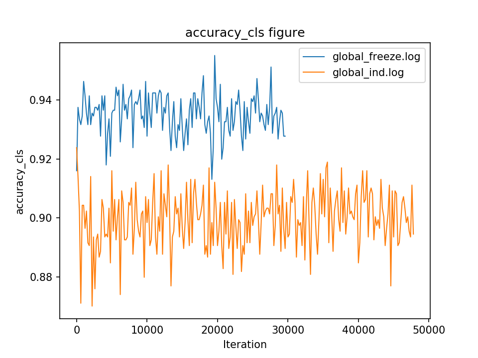

#Analysize the log
You can use the python analysis script in `tools/analysis_detectron.py` to get the plot for any item you want in a log file or a folder containing several log files.
#Analysize single log file
For example, if you want to get the plot of `accuracy_cls` item in a log file, you can type
```
python2 tools/analysis_detectron.py --log /path/yourfile --item accuracy_cls \
    --sample_rate 10 -display
```
The plot result will be saved to `[--prefix]accuracy_cls.png`.

You can use the flag `-display` to decide whether show the image.

You can use the flag `--sample_rate` to decide how often the samples will be picked out to plot the figure.

You can use the flag `--prefix` to give the output file a prefix name.
#Analysize directory of log files
For example, if you want to get the plot of `accuracy_cls` item in a directory of log files on same figure, you can type
```
python2 tools/analysis_detectron.py --log /path/yourlogdirectory --item accuracy_cls \
    --sample_rate 10 -display
```
The result is
<div align="center">
  
  <p>Example log analysis output.</p>
</div>

#Other help
You can type ```python2 tools/analysis_detectron.py -h``` for more help and usage about the analysis tool.